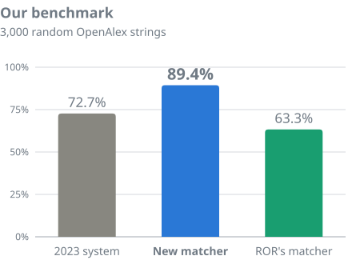
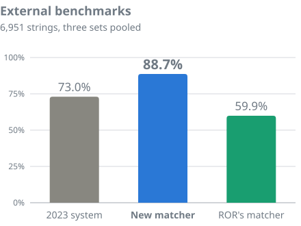
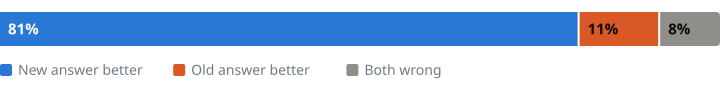
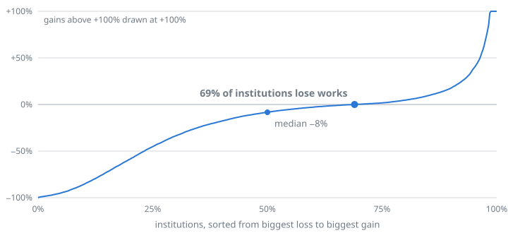

# OpenAlex affiliation matcher

How [OpenAlex](https://openalex.org) decides which institutions an affiliation string names. A string like
*"Dept. of Physics, MIT, Cambridge MA"* becomes a link to the
[institution](https://help.openalex.org/data/institutions/) Massachusetts Institute of Technology. Since
**28 September 2026** this matcher has run on all 165 million affiliation strings in OpenAlex, and it runs on every
new string each night. It replaces our [2023 model](https://github.com/ourresearch/openalex-institution-parsing).
This is **version 3.0.0**, after our V1 (2022) and V2 (2023); see the [changelog](CHANGELOG.md).

> **Everything is here:** the code, the models, every test set, and [what changed for individual
> institutions](institutions/). We keep adding to it as results come in.

## Benchmarks

**The new matcher names exactly the right institutions for 89% of strings, up from 73%.**

 

**Exact match** is the share of strings where a system names exactly the institutions the string names, no more and
no fewer. An institution's list of works is built from these answers, so this is the measure that matters most.

**Our benchmark** is 3,000 affiliation strings drawn at random from OpenAlex, none of them used to build the matcher,
and labelled by Claude Opus 5.5 under [written rules](benchmarks/README.md#what-right-means). **The external
benchmarks** are three sets built by others: Crossref's (2024), Springer Nature's (2023) and a set of strings naming
several institutions chosen by CWTS at Leiden University. Every set, every result, precision and recall, and how we
scored: [benchmarks/](benchmarks/).

## These numbers will keep changing

**Expect institution counts to keep changing, and mostly to grow.** That's a good thing:

- **The matcher keeps improving**, in numbered releases ([semantic versioning](CHANGELOG.md)).
- **We keep getting better at reading affiliations** from PDFs.
- **New works arrive every day, and we keep adding sources.** Right now we are adding thousands of OJS journals that
  don't register DOIs.

This is a living index, not a snapshot.

## How it works

**Find candidates, score each one, choose the set.**

1. **Find candidates.** About 18 possible institutions per string: names and acronyms that appear in the string,
   institutions already linked to very similar strings, and a multilingual embedding search. 99% of the right
   institutions are among them.
2. **Score each one.** A small model ([multilingual-e5-base](https://huggingface.co/intfloat/multilingual-e5-base),
   fine-tuned) estimates how likely it is that the string names each candidate. It learned from 3.7 million
   judgments by [Jev](https://typesafe.ai), a decision model from TypeSafe AI. Each night, Jev itself scores the
   fifth of new strings the small model is least sure about.
3. **Choose the set.** A gradient-boosted classifier looks at all the candidates together and picks none, one or
   several. It reads ROR's parent, child and related links, so it can tell a university from its hospital.
4. **Apply corrections.** Corrections made by people override the matcher.

Every candidate is an OpenAlex institution with a record in [ROR](https://ror.org), the Research Organization
Registry.

## What changed in OpenAlex

**8 in 10 changes are improvements.**



We showed Claude Opus 5.5 the old and new answers for 300 changed strings, without saying which was which. It
preferred the new answer for 81% and the old one for 11%.

In all, 118 million institution assignments changed (60.0 million added, 58.2 million removed) on 54 million works.
These counts come from the full dry run on 27 September; we will replace them with the final ones.

**If you keep a copy of OpenAlex, reload it in full.** Works whose institutions changed kept their `updated_date`,
because the works themselves did not change.

## What it means for institutions

**Most institutions lose some works, and what they lose was mostly wrong.** What changed for a given institution, and
why, with every string it lost and gained: [institutions/](institutions/).



Each point is one institution's change in works, counting its units, for the 27,820 institutions with 1,000 or more
works. Most lose a little; large institutions tend to gain. We drew 60 institutions at random whose works changed by
more than 10% and judged samples of what each gained and lost: **56 of the 60 are more accurate now.**

**Catch-all institutions are gone: 9,363 → 0.** The 2023 model picked from a fixed list and leaned on the words in a
name, so some records collected strings that only looked like them. The new matcher links an institution only when
the string names it.

| Institution | Collected strings naming | Works before → after |
|---|---|---:|
| Harvard University Press | Harvard University | 285,458 → 4,060 |
| Mayo Clinic in Arizona | Mayo Clinic in Rochester | 147,083 → 30,213 |
| Neurological Surgery (US) | any neurosurgery department | 59,082 → 2,941 |
| Research Triangle Park Foundation | anything located in Research Triangle Park | 30,510 → 402 |

**Merged universities: `works_count` falls, mostly correctly.** Older strings for merged universities, like
"Université Paris Diderot", now go to the predecessor's own record. It rolls up to the merged university
(Université Paris Cité) but is not part of that university's `works_count`, which counts only works linked to the
institution itself. Filtering works by `authorships.institutions.lineage` still finds them. Some real works were lost
on strings like "University of Paris VII, Paris, France", now left with no institution; we are fixing these in a
rerun this week.

**New ROR records.** The 2023 model could never name an institution created after April 2023. Of the 4,130
institutions ROR added from 1 to 21 September 2026, it named 3; the new matcher names 3,498. From this week, new ROR
records are matched automatically: on new works the night after they appear, and on older works by a daily sweep.

**Your corrections still win.** Links added or removed in the
[Affiliation Editor](https://help.openalex.org/access/fixing-errors/affiliations/) or by our support team override
the matcher, as before. Found a wrong match? See
[fixing affiliations](https://help.openalex.org/access/fixing-errors/affiliations/) or
[tell us](https://openalex.org/contact).

## Known issues

- Some strings that name an institution get no answer, when two related candidates both score high (the "University
  of Paris VII" case). Rerun this week.
- Health systems that ROR does not link to their university (Johns Hopkins Medicine, Stanford Medicine) are sometimes
  added beside the university.
- Organisations with no ROR record can't be matched until ROR adds one.

## Reproduce it

Everything needed to check our numbers is here. On a laptop, with no GPU and no Jev:

```
pip install -r requirements.txt
python scripts/decide.py test_v2
python -m matcher.score test_v2 --conf high --pred new_matcher=preds/test_v2.jsonl
```

That gives 89.6% exact match on our benchmark in under a minute. With a GPU, you can recompute the small model's
scores from the [released weights](https://github.com/ourresearch/openalex-affiliation-matcher/releases/tag/v3.0.0)
and get the same answers. [REPRODUCE.md](REPRODUCE.md) has all three paths, including how to retrain the chooser and
the small model on the 3.76 million Jev judgments we released.

## License and credits

Code: MIT. Data we created: [CC0](https://creativecommons.org/publicdomain/zero/1.0/), like all OpenAlex data. Test
sets made by others keep their licenses; see [benchmarks/](benchmarks/). Thanks to ROR, Crossref, Springer Nature and
CWTS for publishing theirs.

Questions: [help.openalex.org](https://help.openalex.org) or [contact us](https://openalex.org/contact).
