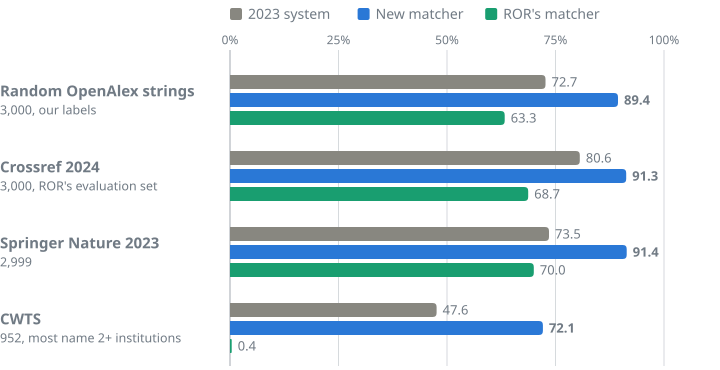

# Benchmarks

Every set we scored the matcher on, every result, and how we scored. The test sets themselves, with labels, will be
added to this directory; the external ones keep their licenses (below).

## The sets

| Set | Strings | What it is | Source and license |
|---|---:|---|---|
| **Our benchmark** (test v2) | 20,000 | Drawn at random from OpenAlex on 26 September 2026; 17,906 labelled with high confidence. The main charts use a random 3,000 of these. | OpenAlex, CC0 |
| Test v1 | 20,000 | An earlier random draw, the same way; 17,736 high confidence. | OpenAlex, CC0 |
| Crossref 2024 | 3,000 | Affiliation strings from Crossref metadata with their ROR ids, collected 19 February 2024. | [Crossref Marple](https://gitlab.com/crossref/marple) and [ror-affiliation-matching-eval](https://github.com/adambuttrick/ror-affiliation-matching-eval), MIT |
| Springer Nature 2023 | 3,000 | Springer Nature affiliation strings with ROR ids (2,999 distinct). | [Crossref Marple](https://gitlab.com/crossref/marple), MIT |
| CWTS | 952 | Strings naming two or more institutions (all but 7), chosen by CWTS at Leiden University and labelled by OpenAlex in 2023. | [openalex-institution-parsing](https://github.com/ourresearch/openalex-institution-parsing/tree/main/V2), released publicly by OurResearch in 2023; curation by CWTS |
| ROR API logs 2023 | 690 | Strings sent to ROR's affiliation service, with ROR-assigned ids. | [affiliation-matching-experimental](https://github.com/ror-community/affiliation-matching-experimental), MIT |
| Crossref publisher-asserted 2023 | 6,747 | Strings with the ROR id the publisher deposited in Crossref. | same, MIT |

## How we scored

- **Exact match:** the share of strings where the answer is exactly the set of institutions the string names.
- **Precision:** the share of named institutions that are right. **Recall:** the share of the right institutions that
  are named. **F-score:** their harmonic mean.
- **Our labels.** Claude Opus 5.5 labelled every institution each string names, under the rules
  [below](#what-right-means), with a confidence. Claude Fable 5.1 relabelled 2,000 strings and agreed on 97.4%. The
  matcher's answers on test v2 were frozen before its labels existed. Nothing was trained on either test set.
- **External labels.** They usually list one institution per string, and sometimes none, even when a string names
  more. Where any system named an institution the labels lack, Claude Opus 5.5 judged whether the string names it,
  without knowing which system named it (2,005 such links). The ones it confirmed count as right for every system.
  Results on the labels alone are [below](#on-the-external-labels-alone).
- **No training on test strings.** External strings found in our development sets were removed and the chooser was
  retrained without them. This mattered for CWTS, whose strings were in a development set: worth 7.0 points of exact
  match, which the scores here do not include. 33 of 13,308 strings in ROR's sets overlapped (0.2 points of F1).
- **The systems.** *2023 system:* OpenAlex's answers until 27 September 2026 (the 2023 classifier, hand-written rules
  and curations). *New matcher:* on our benchmark, the answers now in OpenAlex; on external sets, the version anyone
  can run (the small model and the chooser, no Jev). *ROR's matcher:* its published results (single search,
  7 January 2025) on Crossref 2024 and Springer Nature 2023; its live service (single search, 27 September 2026) on
  our benchmark and CWTS. It returns at most one institution per string.

## Results by set

| Benchmark | System | Exact match | Precision | Recall | F-score |
|---|---|---:|---:|---:|---:|
| Our benchmark (3,000) | 2023 system | 72.7 | 82.3 | 82.4 | 82.4 |
| | **New matcher** | **89.4** | 92.9 | 95.9 | 94.3 |
| | ROR's matcher | 63.3 | 94.8 | 58.6 | 72.4 |
| External, pooled (6,951) | 2023 system | 73.0 | 91.9 | 81.8 | 86.6 |
| | **New matcher** | **88.7** | 96.4 | 93.5 | 94.9 |
| | ROR's matcher | 59.9 | 98.6 | 65.5 | 78.7 |
| Crossref 2024 (3,000) | 2023 system | 80.6 | 89.4 | 91.2 | 90.3 |
| | **New matcher** | **91.3** | 95.6 | 95.7 | 95.6 |
| | ROR's matcher | 68.7 | 97.7 | 72.6 | 83.3 |
| Springer Nature 2023 (2,999) | 2023 system | 73.5 | 92.1 | 81.3 | 86.4 |
| | **New matcher** | **91.4** | 96.2 | 95.7 | 96.0 |
| | ROR's matcher | 70.0 | 99.0 | 76.3 | 86.2 |
| CWTS (952) | 2023 system | 47.6 | 96.3 | 70.1 | 81.2 |
| | **New matcher** | **72.1** | 97.9 | 87.1 | 92.2 |
| | ROR's matcher | 0.4 | 99.5 | 39.8 | 56.8 |

## Our benchmark in full

All high-confidence strings, the answers now in OpenAlex:

| Test set | System | Exact match | Precision | Recall | Strings with a wrong institution |
|---|---|---:|---:|---:|---:|
| Test v2 (17,906) | 2023 system | 73.5 | 82.3 | 82.6 | 14.4 |
| | New matcher | 89.4 | 93.0 | 95.5 | 4.7 |
| Test v1 (17,736) | 2023 system | 73.2 | 82.1 | 82.3 | 14.6 |
| | New matcher | 90.1 | 93.6 | 95.7 | 4.2 |

A wrong institution is one the string does not name, not even as the parent of a unit it names.

By kind of string (test v2, exact match):

| Kind of string | 2023 system | New matcher |
|---|---:|---:|
| Names two or more institutions | 36.4 | 77.2 |
| Names no institution | 68.1 | 89.6 |
| Names one institution | 81.1 | 91.2 |
| Used on two or more works | 78.3 | 91.0 |

Each part of the matcher (test v2, exact match):

| Version | Exact match |
|---|---:|
| 2023 system | 73.5 |
| Chooser alone, no model scores | 82.5 |
| + the small model's scores | 88.8 |
| + ROR's links in the chooser (runs without Jev) | 89.6 |
| + Jev on the strings the small model is unsure about (the nightly version) | 90.4 |
| The answers now in OpenAlex | 89.4 |

## On the external labels alone

Exact match without the judge:

| Benchmark | 2023 system | New matcher | ROR's matcher |
|---|---:|---:|---:|
| Crossref 2024 | 78.6 | 83.9 | 76.4 |
| Springer Nature 2023 | 73.7 | 84.6 | 75.5 |
| CWTS | 48.5 | 65.9 | 0.4 |

Scored with ROR's evaluation code (micro precision, recall, F1 and F0.5 over string and ROR id pairs, labels as given;
from [Marple](https://gitlab.com/crossref/marple)). The labels name one institution per string; our rules name every
institution a string names, so the "most confident id" rows show our matcher under the labels' convention.

| Benchmark | System | Precision | Recall | F1 | F0.5 |
|---|---|---:|---:|---:|---:|
| Crossref 2024 | New matcher | 84.8 | 95.7 | 89.9 | 86.8 |
| | New matcher, most confident id | 90.1 | 86.2 | 88.1 | 89.3 |
| | 2023 system | 82.4 | 91.2 | 86.6 | 84.1 |
| | ROR's matcher | 97.5 | 72.6 | 83.3 | 91.3 |
| Springer Nature 2023 | New matcher | 86.9 | 95.7 | 91.1 | 88.5 |
| | New matcher, most confident id | 95.0 | 87.5 | 91.1 | 93.4 |
| | 2023 system | 87.1 | 81.3 | 84.1 | 85.8 |
| | ROR's matcher | 98.5 | 76.3 | 86.0 | 93.1 |

ROR's 2023 sets, under ROR's 2023 metric (one id per string; our most confident id). Other systems' results on these
sets are in ROR's [published results](https://github.com/ror-community/affiliation-matching-experimental).

| Benchmark | System | Precision | Recall | F1 | F0.5 |
|---|---|---:|---:|---:|---:|
| ROR API logs 2023 (690) | New matcher | 82.7 | 96.6 | 89.1 | 85.1 |
| | OpenAlex 2023 model (ROR's run) | 74.6 | 83.0 | 78.6 | 76.1 |
| Crossref publisher-asserted 2023 (6,747) | New matcher | 85.5 | 96.7 | 90.7 | 87.5 |
| | OpenAlex 2023 model (ROR's run) | 80.7 | 83.5 | 82.1 | 81.3 |

## The blind judge on changed strings

300 strings whose institutions changed, 75 from each group, drawn at random. Claude Opus 5.5 saw the old and new
answers without knowing which was which. Weighted by the number of changed strings in each group: new answer better
81%, old answer better 11%, both wrong 8%.

| Strings used on | New answer better | Old answer better | Both wrong |
|---|---:|---:|---:|
| 100 or more works | 56 | 10 | 9 |
| 10 to 99 works | 63 | 8 | 4 |
| 2 to 9 works | 68 | 5 | 2 |
| 1 work | 59 | 9 | 7 |

## What "right" means

The rules our labels follow (full labelling instructions to come in this directory):

- **Name what the string names, at the level it names it.** "Institute of Physics, University of X" gets both the
  institute (if it has its own record) and the university. Parents come through ROR's hierarchy.
- **ROR decides membership.** Whether a hospital, joint lab or campus belongs to a university is ROR's call. Where
  ROR is wrong, we fix it in ROR, not in the matcher.
- **Merged institutions keep their own record.** A string naming "Université Paris Diderot" goes to that record,
  which rolls up to Université Paris Cité. Former names go to the current record.
- **A string that names no institution gets none.** "Department of Physics" alone is not enough.
- **A comma inside an official name is punctuation.** An address like "Parent, Child" names both.
- **When in doubt, do what a careful person would.** No hand-built fuzzy rules.
